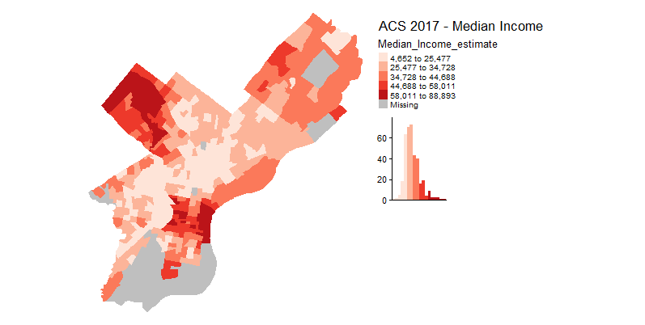

# WrkGrp_SpatialDemo
Ml/AI Working Group Spatial Demo in 'R'
December 20th, 2018

## Overview

This repo was created for AECOM's Machine Learning & Artificial Intelligence Working Group Meeting on December 20th, 2018. The author hopes that the code and documentation provided here will act as both a basic Introduction to 'R' and offer supplementary workflows for differing tasks involving spatial data. Traditionally, tasks involving spatial data would be completed in a GIS. Geographic Information Systems (GIS) are, “a specialist information technology (IT) used for handling mapped data” (Burrough, McDonnell, & Llyod, 2015). The most popular of these systems is ESRI's ArcGIS, a gooey interface for managing and visualizing spatial data. Increasingly, GIS related tasks are accomplished in a coding environment such as ‘R’ or ‘Python’. For those who are familiar with GIS technologies and software - this is different than coding in an ArcPy console.

Although, there are certain GIS tasks that are better suited for a traditional GIS environment, there are many that are best to R or the Conda environment for Python. The control and reproducibility, offered in the coding environment, is leaps and bounds ahead of anything a traditional GIS can do. As capabilities around spatial data manipulation and analysis in R increase more people, GIS Specialists and Novices, are looking to use R as a GIS.

The contents of this repo are very simplistic but I hope any user enjoys getting their feet wet!!!!

## New to the 'R' Programming Language?
If you are an employee at AECOM you will need Temp Admin to complete the following installations.

**Install R**

1) Download R from http://cran.us.r-project.org/.
2) Click on Download R for Windows. Click on 'install R for the first time' under Base.
3) Download the most recent version.
4) Install R. Leave all default settings in the installation options.

**Install RStudio**

1) Go to www.rstudio.com and click on the "Download RStudio" button.
2) Click on "Download RStudio Desktop."
3) Click on the version recommended for your system. Leave all default settings.

## Documation 
Code: WrkGrp_SpatialDemo_Code.R

Data: *.zip, for download, called Data

## Other Spatial Data Sources
Most of these datasets are specific to the US and some even the Philadelphia area. There are many open datasets provided by national and local governments for countries across the world.

*This space will be updated with data sources relevant to the UK in the not-too-distant future.

[PASDA](http://www.pasda.psu.edu/) - Open GIS Data Access for Pennsylvania. Includes a variety of different types of data both raster and vector ranging from centerlines to roads to flood depth grids.

[Open Data Philly](https://www.opendataphilly.org/) - A catalog of all the open data in the Philadelphia region (some of which is spatial). The repository covers topics from arts and culture to politics and real-estate. You can check 

[National Map Viewer](https://apps.nationalmap.gov/download/) - The data download for the National Map Viewer, maintained by the United Staes Geological Survey primarily has land cover and elevation data. This is a good place to get a raster to play with.

[Open Government](https://www.data.gov/open-gov/) - Open data repository for the US government covering everything from agriculture to maritime and finance.